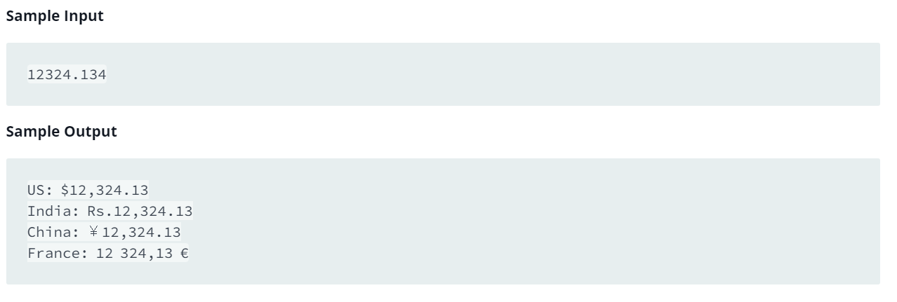

Source: https://www.hackerrank.com/challenges/java-currency-formatter/problem

Problem: Given a double-precision number, payment, denoting an amount of money, use the NumberFormat class' getCurrencyInstance method to convert peymant into the US, Indian, Chinese, and French currency formats. Then print the formatted values as follows:

US: formattedPayment

India: formattedPayment

China: formattedPayment

France: formattedPayment

Example: 
