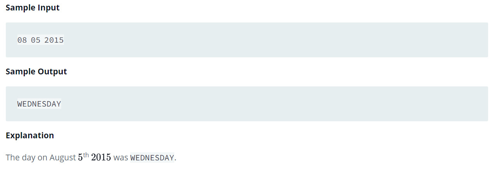

Source: https://www.hackerrank.com/challenges/java-date-and-time/problem?isFullScreen=false

Problem: You are given a date. You just need to write the method, getDay, which returns the day on that date

Example: 

https://www.geeksforgeeks.org/localdate-of-method-in-java-with-examples/

https://www.geeksforgeeks.org/localdate-getdayofweek-method-in-java/