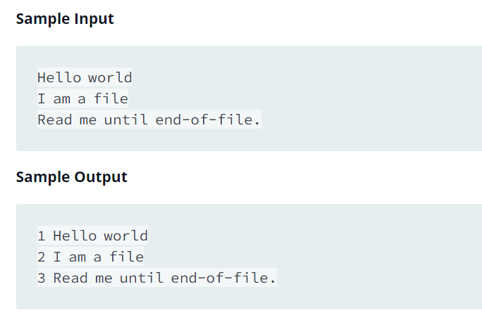

Source: https://www.hackerrank.com/challenges/java-end-of-file/problem

Problem: The challenge here is to read n lines of input until you reach EOF, then number and print all n lines of content.

Example: 

