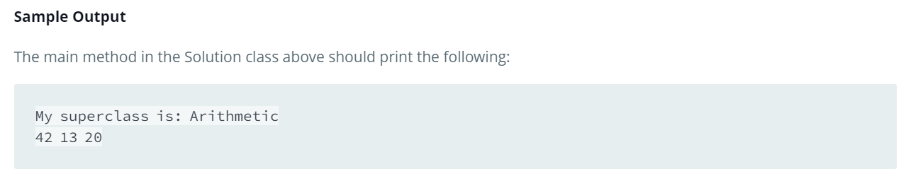

Source: https://www.hackerrank.com/challenges/java-inheritance-2/problem?isFullScreen=false

Problem: Write the following code in your editor below:

1. A class named Arithmetic with a method named add that takes 2 integers as parameters and returns an integer denoting their sum.

2. A class named Adder that inherits from a superclass named Arithmetic.

Example: 

