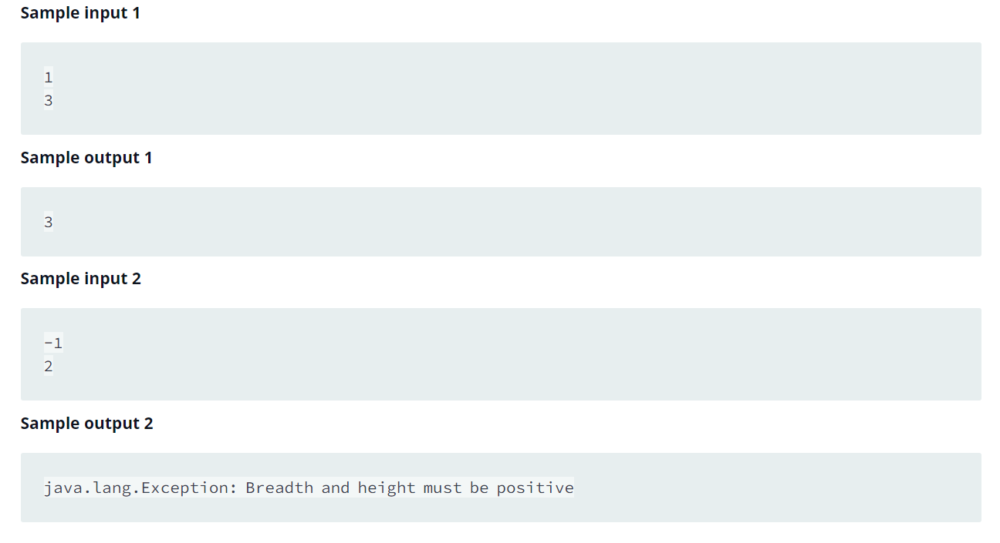

Source: https://www.hackerrank.com/challenges/java-static-initializer-block/problem?isFullScreen=false

Problem: You are given a class Solution with a main method. Complete the given code so that it outputs the area of a parallelogram with breadth B and height H. You should read the variables from the standard input.

Example: 

