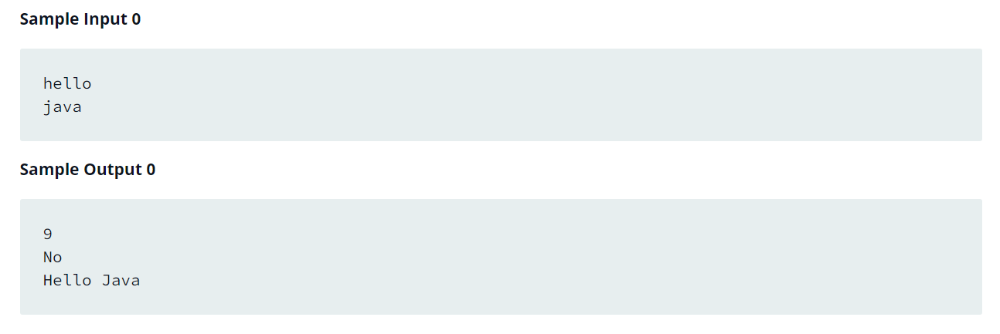

Source: https://www.hackerrank.com/challenges/java-strings-introduction/problem?isFullScreen=false

Problem: Given two strings of lowercase English letters, A and B, perform the following operations:

1. Sum the lengths of A and B.

2. Determine if A is lexicographically larger than B (i.e.: does B come before A in the dictionary?).

3. Capitalize the first letter in A and B and print them on a single line, separated by a space.

Example: 
