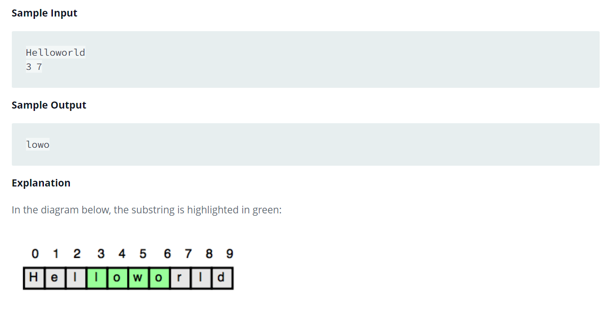

Source: https://www.hackerrank.com/challenges/java-substring/problem?isFullScreen=false

Problem: Given a string, s, and two indices, start and end, print a substring consisting of all characters in the inclusive range from start to end - 1

Example: 
