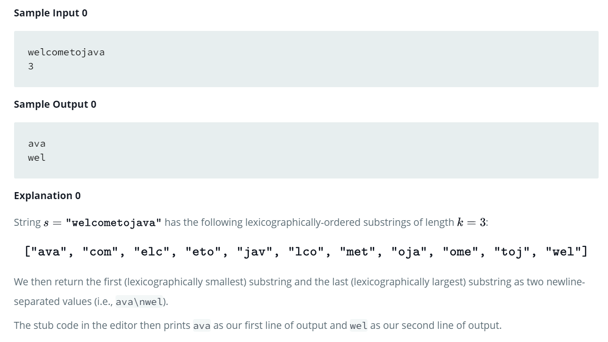

Source: https://www.hackerrank.com/challenges/java-string-compare/problem

Problem: Given a string, s, and an integer, k, complete the function so that it finds the lexicographically smallest and largest substrings of length k.

Example: 

